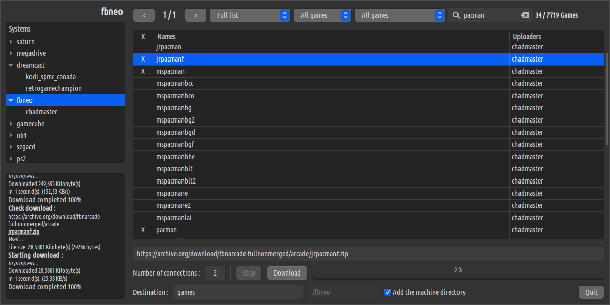

## scrom

**Description**

`Scrom` is an application that allows you to download ROMs for various emulation systems.
These ROMs are retrieved from [Archive.org](https://archive.org), a site that references
numerous consoles, platforms, and applications related to emulation.

  

This application was developed in Python with the GTK3 graphical library.
The Bash script `scrom.sh` launches the application and manages the addition of new systems.
It scans the `/links` directory for new `.dat` files. These data files contain the system name,
uploader ID, file extension, and system pages. The pages are scanned for ROM download links.
Finally, these links are inserted into a database.
The names of the data files correspond to the system name associated with the uploader ID.  

Example : `links/dreamcast_retrogamechampion.dat` :

```
dreamcast
retrogamechampion
zip
https://archive.org/download/sega-dreamcast-champion-collection-updated-v2/1/
https://archive.org/download/sega-dreamcast-champion-collection-updated-v2/4/
...
```

Example : `links/megadrive_ic3dragon5110.dat` :

```
megadrive
ic3dragon5110
zip
https://ia804709.us.archive.org/view_archive.php?archive=/31/items/megadrive_202212/megadrive.zip
```

Example : `links/ps3_cvlt_of_mirrors.dat`

```
ps3
cvlt_of_mirrors
iso
https://archive.org/download/sony_playstation3_numberssymbols
https://archive.org/download/sony_playstation3_a_part1
...
```

**Dependencies**

[sqlite3](https://www.sqlite.org/index.html) : a C library that provides functions for manipulating SQLite databases.  
[curl](https://curl.haxx.se/) : a command-line library that allows you to use communication protocols on the Internet, such as HTTP.  
[lynx](http://lynx.browser.org/) : a text-based web browser that allows you to navigate the Internet in a terminal environment.  
[axel](https://github.com/axel-download-accelerator/axel) : a fast download tool that allows you to download files from the Internet.  

**Usage**

Once in the `scrom` directory, simply execute `./start.sh`.

